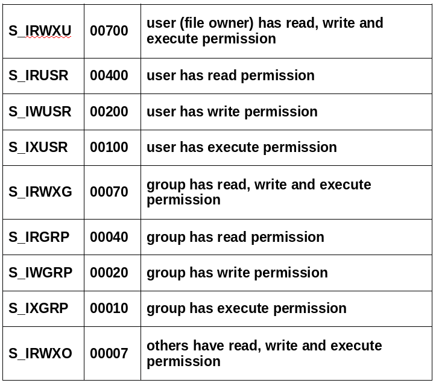

# Assembly I/O

## Objectives
#### Objectives are loose due to time restraints and current status of course
* Understand and Identify basic facts about Linux files and file descriptors
* Implement wrappers for several file I/O system calls
* Understand and utilize file-based process bookkeeping and mecanisms (via /proc)


### Files and Operations
* UNIX Model - Everything is a file!
* File extensions don't actually do anything, they are just used to organize really. 
* File Descriptors
    * A bookkeeping mechanism to represent your access to a resource
    * Some reserved numbers: 0/1/2 (for std in/out/err)

### What are file descriptors? 
* Entries into a table
* One exists for each process
* Each entry in the process table points to a System File Table entry

### File Pointer
* A pointer that keeps track of your current location in a file
* Maintained per system file table entry
* Calls to "read", "write", or "lseek" (amount others) modify

#### File Pointer Example
* Assume the file "tmp.txt" contains: "abcdefghij"

```c
char buf[10] = {0};
// Assuming no failures, fd

// now contains a file descriptor
int fd = open("tmp.txt", O_RDONLY);

if(-1 == fd) {
    return -1; // the open failed!
}

// At this point, the file pointer is at the start

read(fd, buf, 5);
// where does it point now?
```

* Assuming no errors and all 5 bytes were read:
    * buf now contains: "abcde"
    * The file pointer is now at 'f'

---
### File Operations
* Read and Write
* Open and Close (for existing files)
* Unlink (for deleting)
* Syncing changes -msync and fsync

### Syscall info -pt1
Syscall | RAX | RDI | RSI | RDX | R10 | R8 | R9
--- | --- | --- | --- | --- | --- | --- | ---
read | 0 | Descriptor | buffer ptr | Count | | | 
write | 1 | Descriptor | buffer ptr | count | | |
open | 2 | filename(char*) | flags | mode | | |
close | 3 | Descriptor | | | | |  
unlink | 87 | Path(char*) | | | | | 
msync | 26 | address start | length | flags | | | 
fsync | 74 | Descriptor | | | | | 

### Flags and Modes
####  Msync Options
%define is used to create macros in asm
```
; Flags to 'msync'
%define MS_ASYNC 1 ; Sync memory asynchronously
%define MS_Sync 4  ; Synchronous memory sync
```

#### Open options
* One of the following options must be chosen
```
%define O_RDONLY        00
%define O_WRONLY        01
%define O_RDWR          02
```

* Zero or more of the following may be chosen:
```
%define O_Creat 0100    ; Create the file
%define O_TRUNC 01000   ; Truncate (if exists)
%define O_APPEND 02000  ; Append

### Mode
* IF file is being created, specifies permissions to set on it
* Can be one of the following values (follow UNIX-style persmission rules:



### Lseek
* Lets you move to an offset within a file (moves the files pointer)
* Returns the distance (in bytes) your current offset is from the file's beginning

Syscall | RAX | RDI | RSI | RDX | R10 | R8 | R9
--- | --- | --- | --- | --- | --- | --- | ---
lseek | 8 | int (fd) | long offset | origin  | | |

* Values for origin (indicating where to move from):

```
%define SEEK_SET 0      ; Seek from the beginning of file
%define SEEK_CUR 1      ; Seek from current position
%define SEEK_END 2      ; Seek from the end of the file
```

### Stat
* Stat system call can also be used to retrive file size
* Requires an additonal structure definition
* Take a look at "man 2 stat" for further information

---

### Opitional Lab - File I/O
* Create system call wrappers to:
    * Open existing files
    * Create new files
    * Read from and write to files
    * Move the location of the file pointer
    * Find the file size via lseek or stat

---

## Directories

* Several syscalls exist to read directories
* Focus will be on getdents

Syscall | RAX | RDI | RSI | RDX | R10 | R8 | R9
--- | --- | --- | --- | --- | --- | --- | ---
getdents | 78 | int (fd) | struct dirent* | buff size | | |

### Opitional Lab - File I/O
#### Entries
* List the contents of a directory
* Required Objectives:
    * List the contents of a directory
    * Print them to the screen

## Additonal Syscalls and Labs
* Take a look inside the powerpoint if you are feeling hungry for more practice or information
