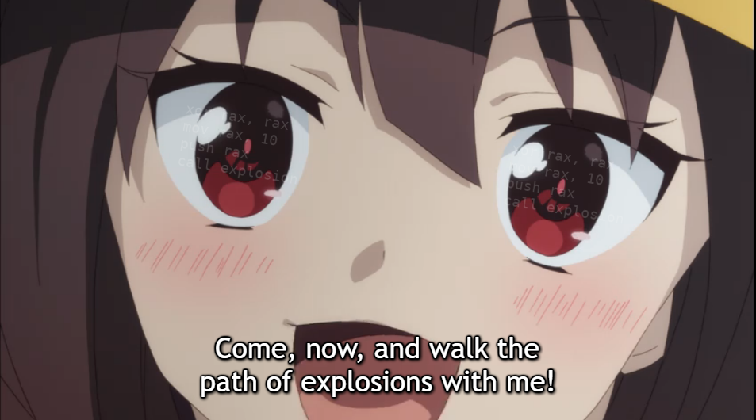

# IQT Assembly Course 
## ATTENTION! THIS IS AN INTRODUCTORY COURSE THAT IS CURRENTLY BEING UPGRADED... NOT ALL COURSE MATERIAL IS UP TO STANDARD 
This course is intended for students who currently require it. Much of this course is incomplete and not all of it will be taught. The course is currently being converted to markdown language. Only view this material if you require it. 

## IF YOU NEED THIS COURSE:
Please use the Powerpoint slides under the "backup\_slides" directory. The markdown is not yet ready for release. 

### REQUIRMENTS
- C/C++ Programming Knowledge
- Linux Distro (Fedora is used for this course)
- Windows 10
- CMAKE
- GDB
- NASM
- GCC/G++
- WinDBG
- Text Editor (Visual Studio Code, VIM/Vi, Atom, Sublime Text, etc)

### TODO: 
* Convert slides to markdown (CH1-3 fully converted)
* Update Chapter 6, 7 and 9
* Clean up structure
